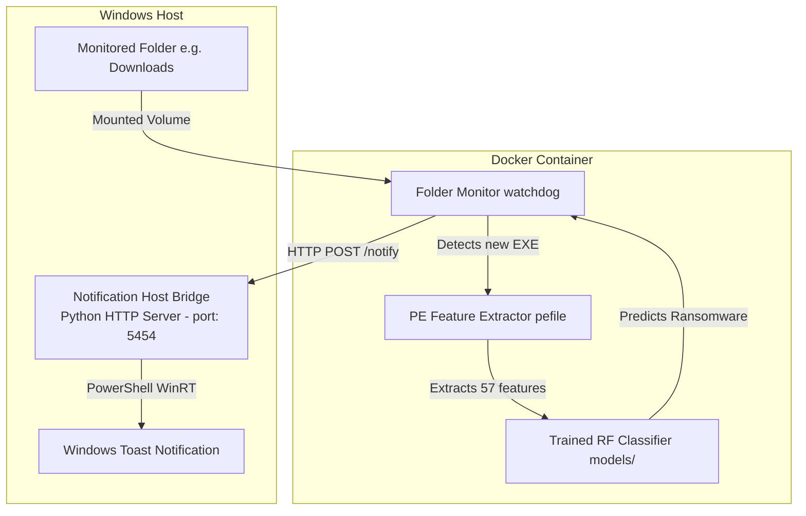

# Real-Time Pre-Execution Ransomware Detection Project

An internship project for Windows-focused pre-execution ransomware detection. The system intercepts newly downloaded or copied files in real time (within a Docker container), extracts static Portable Executable (PE) header/section features, and tests them against a trained Machine Learning model. If ransomware is detected, the container bridges the alert back to the Windows host to trigger a native Windows Toast notification before the file runs.

---

## System Architecture

The project consists of a **host-side notification bridge** and a **containerized folder monitoring daemon**:



---

## Dataset & Preprocessing Pipeline

### 1. Dataset Split and Composition
*   **Total Dataset Size**: 21,752 executable records (balanced evenly with 10,876 Benign files and 10,876 Malware files).
*   **Malware Target Classes**: Includes 26 malware families, with ransomware categories (such as Cerber, Dharma, Shade, WannaCry, Ryuk, etc.) and other malware classes (RAT, Stealers, Trojans).
*   **Custom Samples**: An additional dataset (`my_ransomware_samples.csv`) compiled from 27 real ransomware binaries was merged during training to enhance zero-day detection capability.
*   **Split Ratio**: 80% Training Set (13,677 samples) and 20% Test Set (3,420 samples), stratified to preserve the class balance.

### 2. Preprocessing & Feature Engineering (`src/data/preprocess.py`)
To build a reliable **pre-execution** model, we must strip all dynamic runtime features because they cannot be gathered before a program actually executes. The pipeline includes:
*   **Binary Labeling**: Creates a binary target column where `1` represents `Category == Ransomware` and `0` represents goodware or other non-ransomware categories.
*   **Feature Filtering**: Drops data-leakage columns (`md5`, `sha1`, `Class`, `Category`, `Family`) and all post-execution behavioral columns (such as `registry_read/write`, `network_connections`, `files_malicious`, etc.).
*   **Numeric Conversion**: Parses PE numeric fields and hex strings (e.g. `0x00400000`) into standard floats.
*   **Ratio Features**: Calculates engineered PE ratios used to identify obfuscation/packing:
    *   `CodeDensity` = `SizeOfCode` / `SizeOfImage`
    *   `HeaderRatio` = `SizeOfHeaders` / `SizeOfImage`
    *   `TextRawToVirtualRatio` = `text_SizeOfRawData` / `text_VirtualSize`
    *   `RdataRawToVirtualRatio` = `rdata_SizeOfRawData` / `rdata_VirtualSize`
*   **Dimensionality Reduction**: Automatically removes constant features (features containing only a single value) and duplicate rows.

---

## Model Evaluation Metrics

Evaluated on the test set (3,420 samples) after training a Random Forest classifier (300 estimators, balanced weights):

| Parameter | Value | Interpretation |
| :--- | :--- | :--- |
| **Accuracy** | **97.69%** | Percentage of overall files correctly identified. |
| **Precision** | **95.90%** | When the model flags a file as ransomware, it is correct 95.90% of the time (low false-positive rate). |
| **Recall** | **77.23%** | The model successfully intercepts 77.23% of all actual ransomware files in the test set. |
| **F1 Score** | **85.56%** | Balance between Precision and Recall. |
| **ROC AUC** | **0.9819** | Area under the Receiver Operating Characteristic curve. |
| **PR AUC** | **0.9312** | Area under the Precision-Recall curve (ideal for imbalanced data evaluation). |
| **Training Time** | **1.5118 seconds** | Total fit time for the Random Forest pipeline. |
| **Avg Inference Time** | **0.029646 ms** | Time taken *per sample* to run feature alignment and predict ransomware class. |
| **Confusion Matrix** | **TN=3107  FP=10**<br>**FN=69   TP=234** | **TN**: Benign correctly identified<br>**TP**: Ransomware correctly stopped<br>**FP**: Benign files incorrectly flagged<br>**FN**: Ransomware files missed |

---

## Execution Guide: From Scratch

Follow these steps to set up and run the entire project on a new Windows machine:

### Step 1: Install Prerequisites
1.  **Python 3.11**: Ensure Python 3.11 is installed (preferred for package compatibility). If missing, you can install it via the Windows Python Launcher command:
    ```cmd
    py install 3.11
    ```
2.  **Docker Desktop**: Install and start Docker Desktop (ensure the Docker whale icon in the taskbar is active).

### Step 2: Clone and Setup Environment
Open a Windows PowerShell terminal:
```powershell
# Clone the repository
git clone https://github.com/ashokpsgitech/Ransomware-detection-ML-model.git
cd Ransomware-detection-ML-model

# Create a virtual environment
py -3.11 -m venv .venv
.\.venv\Scripts\activate

# Install requirements
python -m pip install --upgrade pip setuptools wheel
pip install -r requirements.txt
```

### Step 3: Run Unit Tests
To verify code logic and schema validation:
```powershell
# Install pytest
pip install pytest

# Run tests
python -m pytest tests
```

### Step 4: Train the Custom Model
Run the training pipeline to build the model using the preprocessed datasets:
```powershell
python -B -m src.training.train `
    --dataset datasets/Final_Dataset_without_duplicate.csv `
    --dataset datasets/my_ransomware_samples.csv `
    --model-output models/ransomware_detector_custom.pkl `
    --metrics-output reports/training_metrics_custom.json `
    --profile-output reports/dataset_profile_custom.json `
    --n-estimators 300
```
This writes the model bundle to `models/ransomware_detector_custom.pkl`.

### Step 5: Start the Real-Time Monitor
Start the orchestrator launcher:
```powershell
.\run_monitor.ps1
```
1.  **Monitor Folder**: Enter a path (e.g. `C:\Users\ashok\Downloads` or a dedicated test folder like `D:\test_monitor`).
2.  **Powershell Bridge**: The script automatically launches `src/utils/notification_host.py` in a separate command window to listen on port `5454`.
3.  **Docker Monitor**: The script builds the `ransomware-detector` Docker image and launches the container, mounting your selected folder.

### Step 6: Test Detection and Notification
1.  Copy any Windows executable (e.g., a copy of `notepad.exe` or `python.exe`) and paste it into your monitored folder.
2.  Watch the Docker terminal. You will see a detailed **Scan Report** printed showing the extracted PE features, predicted category (**`BENIGN`**), probability score, and the model's global parameters.
3.  If a ransomware executable is placed inside, the container calls the host bridge, and a native **Windows Toast notification** will instantly alert you on your desktop.
